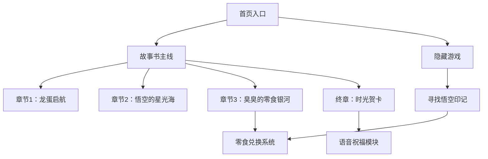
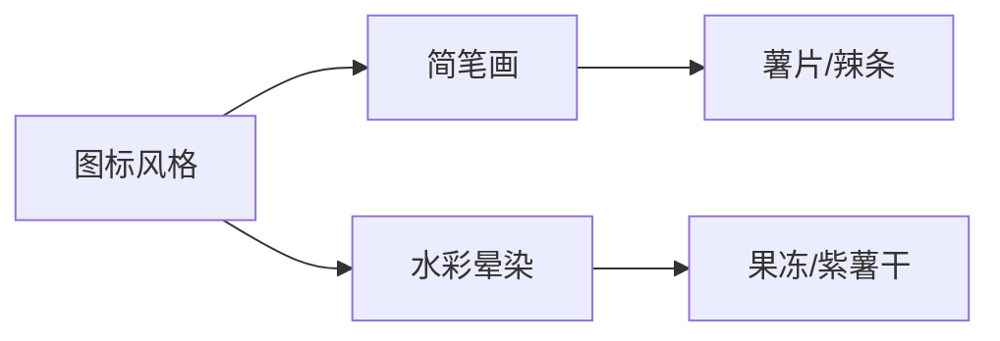
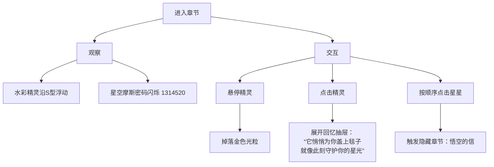
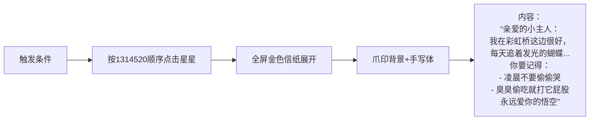

# 《星屿时光机：致亲爱的好朋友》项目计划书

## 一、项目背景

```
### 情感核心
- **对象**：挚友（女生）生日礼物
- **情感表达**： 
  - 珍视友谊（"白月光"情结）
  - 纪念共同经历（方舟游戏"龙蛋"相识）
  - 纪念逝去爱宠"悟空"
  - 关爱现宠物猫"臭臭"
  - 创造童趣体验（她喜欢被当小朋友）

### 视觉体系
- **主色调**：紫色(#8A2BE2)与粉色(#FFC2EF)渐变
- **核心元素**：独角兽（主体载体）、龙蛋（记忆触发点）
- **风格**：梦幻/童话/可爱

### 关键内容元素
| 元素类型 | 具体表现            | 功能作用 |
|----------|-------------------|----------|
| 情感符号  | 龙蛋 | 相识记忆触发 |
| 纪念元素  | 悟空（水彩精灵）    | 逝去爱宠纪念 |
| 现状元素  | 臭臭（猫咪）        | 当下陪伴象征 |
| 惊喜彩蛋  | 10种零食图标       | 情感互动媒介 |
| 实体礼物  | 无人区玫瑰香水      | 现实礼物关联 |

### 技术约束
- **主要工具**：Cursor + Augment
- **开发者技能**：前端基础（能修改HTML/CSS/JS）
- **时间节点**：7月30日前交付
```

## 二、项目架构设计



## 三、模块详细规范

### 1. 故事书系统（主载体）

- **交互方式**：垂直滚动触发动画

- **章节结构**：

  | 章节           | 核心元素 | 动画效果     | 情感表达 |
  | -------------- | -------- | ------------ | -------- |
  | 龙蛋启航       | 脉动龙蛋 | 点击孵化特效 | 相遇回忆 |
  | 悟空的星光海   | 水彩精灵 | S型浮动轨迹  | 永恒守护 |
  | 臭臭的零食银河 | 猫爪按钮 | 零食扭蛋机   | 当下欢乐 |
  | 时光贺卡       | 卷轴展开 | 照片+祝福语  | 生日祝愿 |

### 2. 悟空守护系统

```
stateDiagram-v2
    [*] --> 常态精灵： 页面加载
    常态精灵 --> 悬停状态： 鼠标经过
    悬停状态 --> 回忆抽屉： 点击精灵
    常态精灵 --> 游戏入口： 特殊星标点击
    游戏入口 --> 收集模式： 开始游戏
    收集模式 --> 兑换触发： 集齐5印记
```

### 3. 零食兑换系统

- **触发方式**：
  - 游戏内收集（主要）
  - 故事书章节3彩蛋（次要）
- **交互流程**：
  1. 收集零食图标
  2. 弹出兑换券动画
  3. 显示专属兑换码（例：CHPS-0730）
  4. 提供"联系饲养员"按钮（微信跳转）

### 4. 语音祝福模块

- **技术实现**：

  ```
  flowchart LR
      A[录制10秒语音] --> B[转Base64编码]
      B --> C[网页嵌入]
      C --> D[通关后自动播放]
  ```

- **触发条件**：完成守护游戏

## 四、开发路线图

### 阶段1：基础框架搭建（7/12-7/15）

| 任务     | AI工具指令示例                                  | 交付物       |
| -------- | ----------------------------------------------- | ------------ |
| 网页骨架 | “生成响应式HTML框架：紫色星空背景+浮动云朵动画” | 基础HTML/CSS |
| 章节容器 | “创建全屏滚动容器，带3D翻页效果”                | 章节切换系统 |
| 龙蛋原型 | “实现点击龙蛋播放破碎动画的JS代码”              | 可交互龙蛋   |

### 阶段2：核心模块开发（7/16-7/22）

| 模块     | 关键技术点      | 风险预案       |
| -------- | --------------- | -------------- |
| 水彩精灵 | CSS浮动路径动画 | 简笔画备用方案 |
| 守护游戏 | 物品查找算法    | 无限重试机制   |
| 零食系统 | 弹窗生成逻辑    | 静态兑换码展示 |

### 阶段3：系统集成（7/23-7/27）

| 集成点    | 验证标准     | 测试用例     |
| --------- | ------------ | ------------ |
| 游戏→贺卡 | 勋章自动显示 | 不同成就等级 |
| 语音触发  | 移动端兼容性 | iOS/安卓测试 |
| 兑换系统  | 微信跳转验证 | 真机测试     |

### 阶段4：优化部署（7/28-7/29）

| 任务     | 优化方向    | 工具            |
| -------- | ----------- | --------------- |
| 性能提升 | CSS动画简化 | Augment         |
| 情感校准 | 文案润色    | Cursor          |
| 移动适配 | 响应式调整  | Chrome DevTools |

## 五、情感表达校准表

| 元素   | 实现方式        | 情感目标 |
| ------ | --------------- | -------- |
| 悟空   | 水彩精灵+守护星 | 温暖怀念 |
| 龙蛋   | 动态孵化过程    | 浪漫回忆 |
| 臭臭   | 零食互动        | 当下欢愉 |
| 独角兽 | 贯穿始终        | 童趣守护 |

## 六、资源需求清单

1. **视觉素材**：
   - 悟空水彩画（DALL·E生成）
   - 零食矢量图标（Freepik）
   - 好友照片（贺卡中心）
2. **音频资源**：
   - 背景轻音乐（FreePD）
   - 录制语音祝福
3. **实体准备**：
   - 零食礼包分装
   - 兑换码对应表

# **章节模板设计：《星屿时光机：致亲爱的好朋友》**

## **第一章：龙蛋启航（相遇的星辰）**

```
### 情感目标
- 触发方舟游戏相识的回忆
- 营造命运相遇的浪漫感
- 奠定童话氛围基调

### 视觉蓝图
```mermaid
graph LR
    A[背景] --> B[深紫星空渐变<br>#2E0854→#8A2BE2]
    A --> C[漂浮的齿轮时钟]
    A --> D[流星轨迹装饰]
    F[核心元素] --> G[脉动龙蛋<br>CSS缩放动画]
    F --> H[星尘粒子特效<br>JS Canvas实现]

### 交互设计
1. **初始状态**：
   - 龙蛋居中（直径200px）
   - 周期性呼吸光效（1.1倍缩放）

2. **点击触发**：
   - 蛋壳破碎动画（分裂为6片）
   - 内部浮现：
     ▸ 游戏角色头像（双人并排）
     ▸ 对话气泡："{{自定义文案}}"
   - 背景切换为粉色星云

3. **滚动衔接**：
   - 滚动至1/3处自动播放：
     "这是我们时光机的第一个坐标"
   - 章节过渡：龙蛋化为光点流向第二章

### 文案模板
```html
<!-- AI提示词：生成相遇回忆文案 -->
"在{{年份}}年的{{季节}}，
一颗刻着{{符文图案}}的龙蛋坠落{{服务器名}}。
当{{你的ID}}遇见{{她的ID}}，
星穹便有了新的航线——"
```

### 技术锚点

```
// Cursor生成龙蛋动画的提问模板：
"如何用CSS+JS实现：
 1. 点击时蛋壳分裂成6片（带旋转飞出效果）
 2. 内部浮现两张圆形头像（左你右她）
 3. 头像下方展开对话气泡（从透明到可见）"
```

------

## **第二章：悟空的星光海（永恒的守护）**

```
### 情感目标
- 纪念逝去的爱宠悟空
- 传递温暖怀念而非悲伤
- 建立守护者概念

### 视觉蓝图
```

```
pie
    title 视觉元素占比
    “水彩精灵” ： 35
    “金色星轨” ： 25
    “回忆抽屉” ： 25
    “光粒特效” ： 15
```

### 交互设计

**A. 常态系统**：

- 悟空精灵沿预设路径浮动（S型轨迹）
- 鼠标悬停：掉落金色光粒（CSS粒子动画）
- 点击精灵：展开三层回忆抽屉：
  1. 顶部：悟空旧照（阳光下的微笑）
  2. 中部：回忆语句
  3. 底部：爪印收藏按钮

**B. 游戏入口**：

- 特殊星标闪烁（右下角）
- 点击进入："寻找悟空的印记"游戏

### 文案模板

```
<!-- 回忆抽屉中部文案 -->
"它总在{{时间}}偷偷{{行为}}，
比如把狗粮藏在臭臭的{{地点}}...
但每次你难过时，
它永远第一个递上{{物品}}"
```

### 技术锚点

```
/* 浮动轨迹实现提问 */
"请用CSS动画让#wukong-sprite元素：
 1. 沿S型路径移动（振幅120px）
 2. 每5秒自转360度
 3. 悬停时出现::after伪元素显示'想念你'"
```

------

## **第三章：臭臭的零食银河（当下的欢愉）**

```
### 情感目标
- 展现现宠物带来的快乐
- 制造惊喜互动环节
- 衔接实体礼物

### 核心机制
```mermaid
journey
    title 零食彩蛋触发流程
    section 常态
      发现猫爪按钮： “臭臭的藏宝箱？”
    section 点击触发
      弹出扭蛋机： “摇出今日幸运零食！”
    section 收集
      获得图标： 显示“已收集 1/3”
      集满奖励： 解锁兑换券
```

### 视觉设计

- **扭蛋机原型**：
  - 玻璃罐体（半透明紫色）
  - 摇杆按钮（猫爪造型）
  - 出货口（闪烁光效）
- **零食图标**：



### 兑换系统

| 收集进度 | 奖励机制           |
| -------- | ------------------ |
| 1种零食  | 零食表情包弹窗     |
| 3种零食  | 兑换券（带唯一ID） |
| 5种零食  | 解锁"臭臭皇冠"成就 |

### 技术锚点

```
// Augment优化提问模板：
"请重构以下扭蛋机JS代码：
 1. 增加加速度传感器支持（手机摇动触发）
 2. 添加出货音效（清脆叮当声）
 3. 收集状态本地存储"
```

------

## **终章：时光贺卡（星屿的祝福）**

```
### 情感高潮
- 整合所有情感符号
- 交付生日祝福核心
- 创造记忆锚点

### 动态展开序列
1. **初始态**：
   - 卷轴闭合（两侧独角兽雕饰）
   - 提示文字："轻触开启祝福"

2. **展开过程**：
   - 卷轴横向展开（CSS clip-path动画）
   - 内部元素依次浮现：
     ```mermaid
     sequenceDiagram
         卷轴->>照片： 中心放大显现
         照片->>文字： 环绕飞出祝福语
         文字->>元素： 零食/爪印/龙蛋环绕
```

3. **完成态**：
   - 中央：她的照片（独角兽滤镜+猫耳）
   - 环绕元素：根据游戏成就动态变化
   - 播放按钮：触发语音祝福

### 语音彩蛋
- 触发条件：完成守护游戏
- 播放机制：
  ```mermaid
  flowchart LR
      点击独角兽角 --> 检测成就状态 --> 成就达标 --> 播放Base64音频
```

- 备选方案：成就未达标显示"继续探索时光机吧！"

### 文案框架

html

```
"亲爱的{{昵称}}：
 感谢{{年份}}个日夜的星光同行，
 愿往后的每个{{日期}}，
 都有臭臭偷走你的{{零食}}，
 有悟空守护你的{{愿望}}，
 而我...永远负责把你宠成小朋友！"

# **《星屿时光机：致亲爱的好朋友》完整体验流程**

## 🌌 整体游玩架构

```
journey
    title 星屿时光机体验之旅
    section 启程
      首页星空 --> 龙蛋启航： 垂直滚动
    section 主线
      龙蛋启航 --> 悟空的星光海： 破碎龙蛋化星轨
      悟空的星光海 --> 臭臭的零食银河： 星光指引
      臭臭的零食银河 --> 时光贺卡： 零食铺就彩虹桥
    section 支线
      悟空的星光海 -..-> 摩斯密码彩蛋： 按1314520点击星星
      摩斯密码彩蛋 --> 悟空的信： 隐藏章节
```

## 🎮 详细体验流程

### 第一章：龙蛋启航（00:00-02:30）

```
sequenceDiagram
    玩家->>系统： 打开网页
    系统->>玩家： 深紫星空渐现，坐标(48,80)悬浮岛微光
    系统->>玩家： "1430天前的此刻..." + 凌晨5:20环境音
    玩家->>系统： 滚动页面
    系统->>玩家： 龙蛋呼吸脉动（橙红光效）
    玩家->>系统： 点击龙蛋
    系统->>玩家： 
       蛋壳破碎动画 → 
       星尘喷发 → 
       显示回忆对话框：
       "水晶岛(48,80)的晨光中
        龙蛋孵出我们的第[1430]个黎明"
    玩家->>系统： 点击悬浮岛
    系统->>玩家： 水晶簇闪烁紫光
```

### 第二章：悟空的星光海（02:30-05:00）



### 支线：悟空的信（彩蛋章节）



### 第三章：臭臭的零食银河（05:00-07:00）

```
journey
    title 扭蛋奇遇
    section 发现
      注意右下角： “臭臭的藏宝箱？”
    section 互动
      点击猫爪按钮 --> 扭蛋机降下
      拖动摇杆 --> 视觉震动（适度幅度）
      松开摇杆 --> 零食弹出动画
    section 收集
      获得1种零食 --> 表情包弹窗
      集齐3种 --> 兑换券降临：
          “臭臭认证！#0730-RD
           联系饲养员兑换！”
```

### 终章：时光贺卡（07:00-结束）

```
sequenceDiagram
    玩家->>系统： 滚动至章节
    系统->>玩家： 卷轴缓缓展开（慢速）
    玩家->>系统： 观看动画序列：
        照片显现（轻度童话滤镜）→
        猫耳+独角装饰贴合→
        文字逐行浮现：
        “愿你往后的每个黎明
         万事顺遂，平平安安”
    玩家->>系统： 点击独角兽角（若完成游戏）
    系统->>玩家： 播放语音祝福 + 声波动画
```

## ✨ 完整提示词手册

### 第一章：龙蛋启航

```
"创建响应式网页部分：
 1. 背景：深空蓝渐变(#0c1445→#2a0b5e) 
 2. 中央元素：
    - 悬浮水晶岛(位置：top:48px, left:80px)
    - 脉动龙蛋(直径200px，暗红鳞纹+橙红光效)
 3. 动态元素：
    - 顶部倒计时：'1430天前此刻 - 凌晨5:20'
    - 背景音效：凌晨风声+鸟鸣(嵌入base64音频)
 4. 交互逻辑：
    - 点击龙蛋 → 蛋壳裂成6片飞出动画
    - 显示对话框：'水晶岛(48,80)的晨光中，龙蛋孵出我们的第[1430]个黎明'
    - 点击悬浮岛 → 水晶簇闪烁紫色光晕

 使用CSS动画实现：
   - 龙蛋呼吸效果(缩放1.05倍)
   - 水晶闪烁(亮度变化0.8→1.2)
   - 蛋壳碎片旋转飞出"
```

### 第二章：悟空的星光海

```
"实现以下组件：
 1. 水彩精灵：
    - 波浪浮动轨迹(垂直振幅120px)
    - 悬停时掉落金色光粒(使用CSS伪元素)
    - 点击展开回忆抽屉(三层结构)

 2. 摩斯密码系统：
    - 7颗星星按1314520频率闪烁：
        1=短亮(300ms)/3=短短短/4=短短短短/5=短短短短短/2=短短/0=长亮(900ms)
    - 按顺序点击触发隐藏章节

 3. 回忆抽屉内容：
    - 顶部：照片框(圆角+金色边框)
    - 中部文案：'它总会悄悄为你盖上毯子，就像此刻守护你的星光'
    - 底部：爪印收藏按钮

 要求：
   - 使用CSS关键帧实现星星闪烁
   - 抽屉展开用transform 3D效果"
```

### 第三章：臭臭的零食银河

```
"优化扭蛋机组件：
 1. 视觉震动：
    - 摇杆拖动时触发CSS shake动画
    - 振幅随拖动时间增加(最大8px偏移)
    - 屏幕边缘产生紫色光波扩散

 2. 兑换券系统：
    - 弹窗设计：猫爪底纹+荧光文字
    - ID生成规则：日期(0730)+随机字母(RD)
    - 按钮事件：点击复制兑换码

 3. 收集状态：
    - 本地存储已收集零食
    - 进度显示'已收集 X/3'

 重构要求：
   - 改用requestAnimationFrame优化动画
   - 添加触摸屏支持"
```

### 终章：时光贺卡

```
"实现卷轴贺卡：
 1. 展开动画：
    - 持续时间：3000ms
    - 使用clip-path实现卷轴展开
    - 顺序显现：照片→装饰→文字

 2. 视觉特效：
    - 照片滤镜：brightness(1.1)+saturate(1.15)
    - 文字特效：'万事顺遂，平平安安'添加微光
        (text-shadow: 0 0 8px #ff9ff3)
    - 猫耳/独角装饰：贴合照片人脸

 3. 语音系统：
    - 条件检测：localStorage.gameComplete
    - 播放控制：点击独角兽角触发
    - 视觉反馈：播放时显示声波动画

 性能要求：
   - 使用will-change优化动画
   - 移动端字体适配"
```

### 全局优化

```
"执行全站优化：
 1. 响应式布局：
    - 断点：768px/1024px
    - 移动端：简化动画复杂度

 2. 性能提升：
    - CSS动画改用transform
    - 图片懒加载
    - 合并CSS请求

 3. 情感校准：
    - 所有文案转为第二人称
    - 色彩饱和度统一(+15%)
    - 交互动画时长标准化(300-500ms)"
```

## 🚀 执行路线图

```
gantt
    title 7天开发计划
    dateFormat  YYYY-MM-DD
    section 核心模块
    第一章实现     ：a1, 2025-07-12, 2d
    第二章+彩蛋   ：a2, after a1, 3d
    第三章扭蛋机  ：a3, after a2, 1d
    终章贺卡     ：a4, after a3, 1d
    section 优化测试
    全局整合     ：b1, after a4, 2d
    情感校准     ：b2, after b1, 1d
    移动端测试   ：b3, after b2, 1d
```